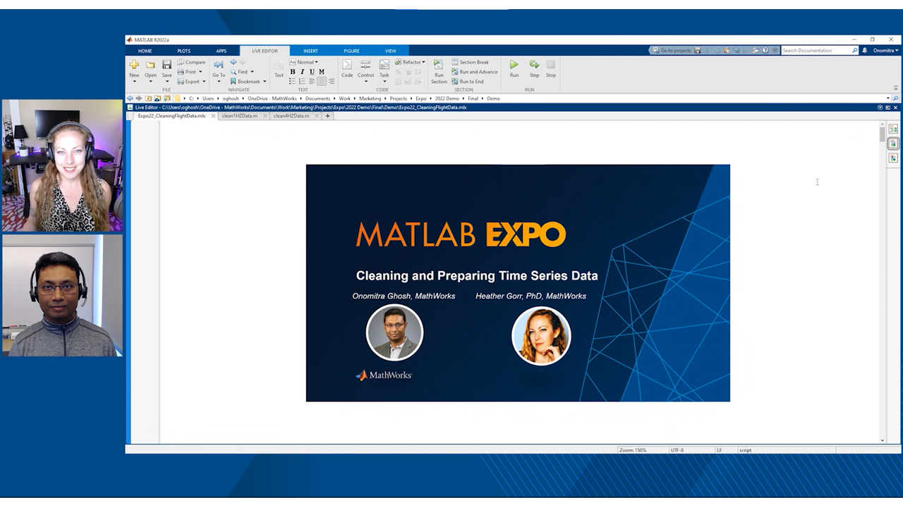

# Cleaning and Preparing Time Series Data 

AI is everywhere, and so is time series data. From manufacturing equipment to automated vehicles, sensors are continuously recording data that can be used for AI powered applications like trend analysis, anomaly detection etc. But quite often, the quality of the data as we receive them, is not ready for analysis or modelling. This demo focuses on how to use MATLAB&reg; to import, explore, clean and prepare time series data for real-world data analysis and predictive modeling. This is part of the MATLAB EXPO 2022 "Cleaning and Preparing Time Series Data" Talk.  It covers both code based and low code approaches to data cleaning that can be scaled up and deployed.

## Setup 
Open and run Expo22_CleaningFlightData.mlx

For the full demo, here is a link to the video:

https://www.mathworks.com/videos/cleaning-and-preparing-time-series-data-1654040877384.html

### MathWorks&reg; Products (https://www.mathworks.com)

Requires MATLAB release R2022a or newer

## License

The license is available in the License file within this repository.

Copyright 2022 The MathWorks, Inc.

